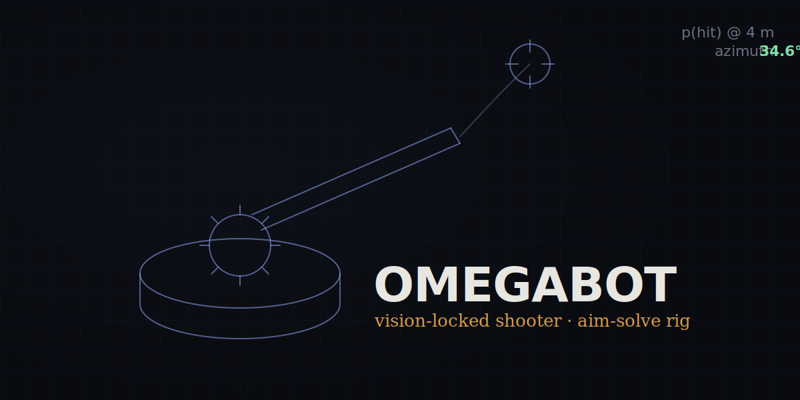

OMEGABOT's whole design goal was to take aiming off the drive team's plate. Point the
robot roughly downfield, hold the trigger, and the shot should already be solved.

## Three loops at once

Getting there meant three control loops running together:

- a **vision loop** that turns AprilTag sightings into a range and bearing to the goal,
- a **control loop** that slews the turret azimuth onto that bearing with a motion profile, and
- a **feedforward** that leans the shot ahead of the robot's own velocity, so a moving base doesn't throw the ball wide.

## What shipped

The turret holds a firing solution while the base drives, and the autonomous routine
chains scoring cycles off the same targeting stack the driver uses in teleop.
